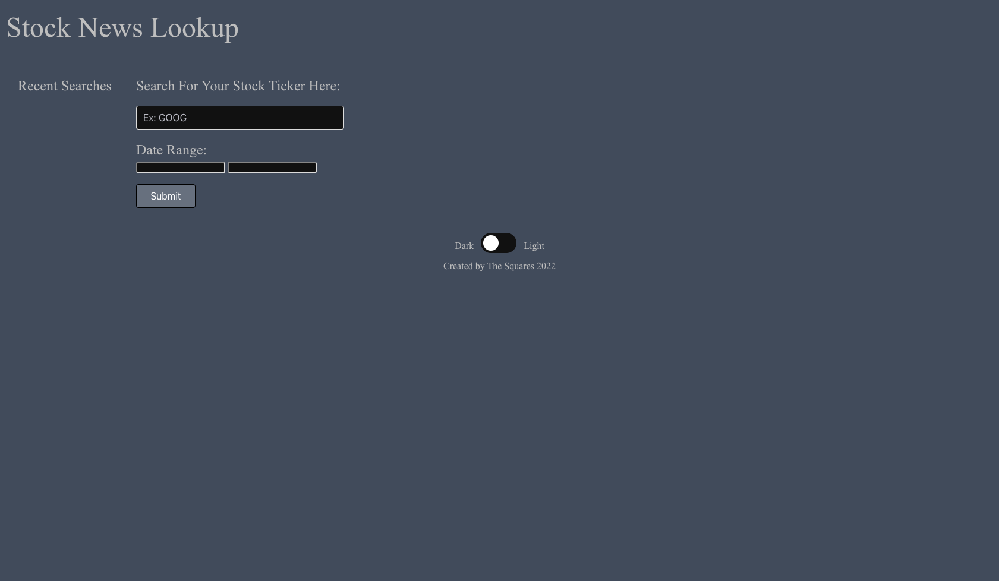
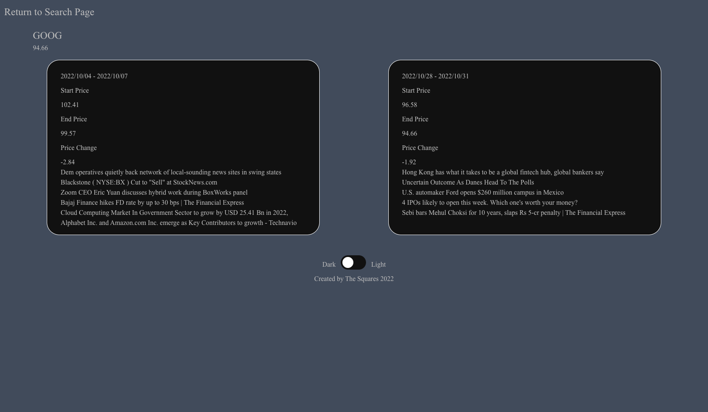

# StockArticleComparison

## User Story

As an amateur investor who lacks professionally paid tools:
I WANT to view stock information, pricing, & articles,
SO THAT I can make predictions of what the stock price may do.

## Acceptance Criteria

WHEN I load the webpage I am presented with a search bar
THEN I can enter my search criteria (stock Ticker or Company name)
WHEN I search for a stock price over a certain date range
THEN I can view articles about that company during that date range

## Description

This website shows historic articles and current articles along with a stock price to compare historical data and current trends to make informed decisions.

- This was the first group project in the coding bootcamp.
- We chose this because it seemed like useful information to have when deciding on stocks.
- We learned that working together helps a project to go along faster.

## Installation

N/A

## Usage

Try searching your favorite stock tickers to display articles and prices past and present.

Link to site: https://bikeller104.github.io/StockArticleComparison

## Credits

Brent - https://github.com/bikeller104
Leland - https://github.com/eljayman
Ari - https://github.com/arinielson
Ryan - https://github.com/rtcottle

Resources:

- README help: https://coding-boot-camp.github.io/full-stack/github/professional-readme-guide
- Stock API: https://www.alphavantage.co/
- EOD API: http://eodhistoricaldata.com/
- Date picker: https://www.npmjs.com/package/js-datepicker
- General help: https://stackoverflow.com/
- MDN: https://developer.mozilla.org
- W3 Schools: https://www.w3schools.com

## License

This project is under the 

## Features

Check for current stock price as well as historical price for your specified company/ticker and get articles for the time period to compare to today's articles.

## Tests

You should be able to put in a ticker (e.g., GOOG, GME, AAPL, etc.) or a company name to get relevant info.
