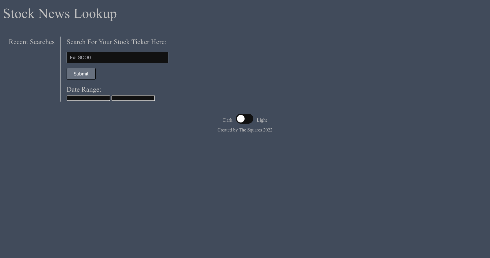

# StockArticleComparison

## Description

This website shows historic articles and current articles along with a stock price.

<!-- TODO: Fill these out below-->
<!-- - What was your motivation?
- Why did you build this project? (Note: the answer is not "Because it was a homework assignment.")
- What problem does it solve?
- What did you learn? -->

## Table of Contents (Optional)

If your README is long, add a table of contents to make it easy for users to find what they need.

- [Installation](#installation)
- [Usage](#usage)
- [Credits](#credits)
- [License](#license)

## Installation

N/A

## Usage

Try searching your favorite stock tickers to display articles and prices past and present.

<!-- TODO: -->

<!-- To add a screenshot, create an `assets/images` folder in your repository and upload your screenshot to it. Then, using the relative filepath, add it to your README using the following syntax:-->

    ```md
    
    ``` 

## Credits

Brent - https://github.com/bikeller104
Leland - https://github.com/eljayman
Ari - https://github.com/arinielson
Ryan - https://github.com/rtcottle

Resources:

- README help: https://coding-boot-camp.github.io/full-stack/github/professional-readme-guide


- Stock API: https://www.alphavantage.co/
<!-- TODO: Add API info, resources, etc.  -->

List your collaborators, if any, with links to their GitHub profiles.

If you used any third-party assets that require attribution, list the creators with links to their primary web presence in this section.

If you followed tutorials, include links to those here as well.

## License

This project is under the [](./LICENSE)

<!-- TODO: Determine if these below want to be used or not.  -->

## Badges


<!-- Badges aren't necessary, per se, but they demonstrate street cred. Badges let other developers know that you know what you're doing. Check out the badges hosted by [shields.io](https://shields.io/). You may not understand what they all represent now, but you will in time. -->

## Features

<!-- If your project has a lot of features, list them here. -->

## How to Contribute

<!-- If you created an application or package and would like other developers to contribute it, you can include guidelines for how to do so. The [Contributor Covenant](https://www.contributor-covenant.org/) is an industry standard, but you can always write your own if you'd prefer. -->

## Tests

<!-- Go the extra mile and write tests for your application. Then provide examples on how to run them here. -->

